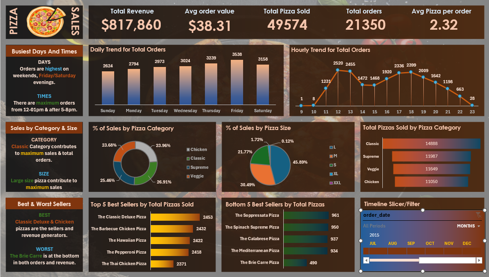

# 🍕 Pizza Sales Analysis



A comprehensive data analysis project for a pizza restaurant using **SQL Server** and **Microsoft Excel**, uncovering key business insights from sales data.

---

## 📌 Table of Contents

- [Overview](#-project-overview)
- [Business Insights](#-business-insights)
- [KPIs](#-key-performance-indicators-kpis)
- [SQL Queries](#-analysis-breakdown)
- [Tools Used](#️-tools-used)
- [Dataset](#️-dataset)
- [How to Run](#-how-to-run)
- [Contact](#-contact)

---

## 📊 Project Overview

This project analyzes pizza sales data to help the business understand performance trends, customer behavior, and product popularity. The analysis covers KPIs, time-based trends, category breakdowns, and best/worst performing products.

---

## 🗂️ Project Structure

```
Pizza-Sales-Analysis/
│
├── data/
│   ├── pizza_sales.csv
│   └── pizza_sales.xlsx
│
├── sql/
│   └── pizza_sales_queries.sql
│
├── excel/
│   └── pizza_sales_dashboard.xlsx
│
└── README.md
```

---

## 🎯 Key Performance Indicators (KPIs)

| KPI | Description |
| :--- | :--- |
| **Total Revenue** | Sum of all pizza sales |
| **Average Order Value** | Revenue divided by number of orders |
| **Total Pizzas Sold** | Total quantity of pizzas sold |
| **Total Orders** | Count of distinct order IDs |
| **Avg Pizzas Per Order** | Average number of pizzas per order |

---

## 📈 Analysis Breakdown

### A. KPIs
- Total Revenue
- Average Order Value
- Total Pizzas Sold
- Total Orders
- Average Pizzas Per Order

### B. Daily Trend for Total Orders
Identifies which days of the week see the highest order volume.

### C. Hourly Trend for Orders
Tracks order patterns throughout the day to find peak hours.

### D. % of Sales by Pizza Category
Breaks down revenue contribution by pizza category (Classic, Supreme, Veggie, Chicken).

### E. % of Sales by Pizza Size
Shows which pizza sizes (S, M, L, XL, XXL) drive the most revenue.

### F. Total Pizzas Sold by Category
Monthly breakdown of quantity sold per pizza category.

### G. Top 5 Best Sellers
The 5 most popular pizzas by total quantity sold.

### H. Bottom 5 Worst Sellers
The 5 least popular pizzas by total quantity sold.

---

## 💡 Business Insights

- **Peak Hours:** Orders spike between **12 PM – 1 PM** and **5 PM – 8 PM**, suggesting a need for more staff during these slots.
- **Best Seller:** The **Classic** pizza category drives the highest revenue share across all categories.
- **Opportunity:** Identifying the **Bottom 5** sellers allows management to reconsider these items on the menu or launch targeted promotions.

---

## 🛠️ Tools Used

| Tool | Purpose |
|------|---------|
| **SQL Server** | Data querying and analysis |
| **Microsoft Excel** | Dashboard, data visualization, Power Query & Data Modeling (for dynamic updates) |

---

## 🗃️ Dataset

The dataset contains pizza order records with the following key fields:

- `order_id` — Unique order identifier
- `order_date` — Date of the order
- `order_time` — Time of the order
- `pizza_name` — Name of the pizza
- `pizza_category` — Category (Classic, Supreme, Veggie, Chicken)
- `pizza_size` — Size (S, M, L, XL, XXL)
- `quantity` — Number of pizzas ordered
- `total_price` — Total price for the order line

---

## 🚀 How to Run

1. **Clone the repository**
   ```bash
   git clone https://github.com/Abdo-Eslam/Pizza-Sales-Data-Analysis-SQL-Excel.git
   ```

2. **Import the data**
   - Open SQL Server Management Studio (SSMS)
   - Import `pizza_sales.csv` into a new database

3. **Run the SQL queries**
   - Open `sql/pizza_sales_queries.sql` in SSMS
   - Execute the queries against your database

4. **View the Dashboard**
   - Open `excel/pizza_sales_dashboard.xlsx` in Microsoft Excel

---

## 📬 Contact

Feel free to connect or reach out if you have any questions!

- **GitHub:** [Abdo-Eslam](https://github.com/Abdo-Eslam)
- **LinkedIn:** [Abdo Eladawe](https://www.linkedin.com/in/abdo-eladawe/)
